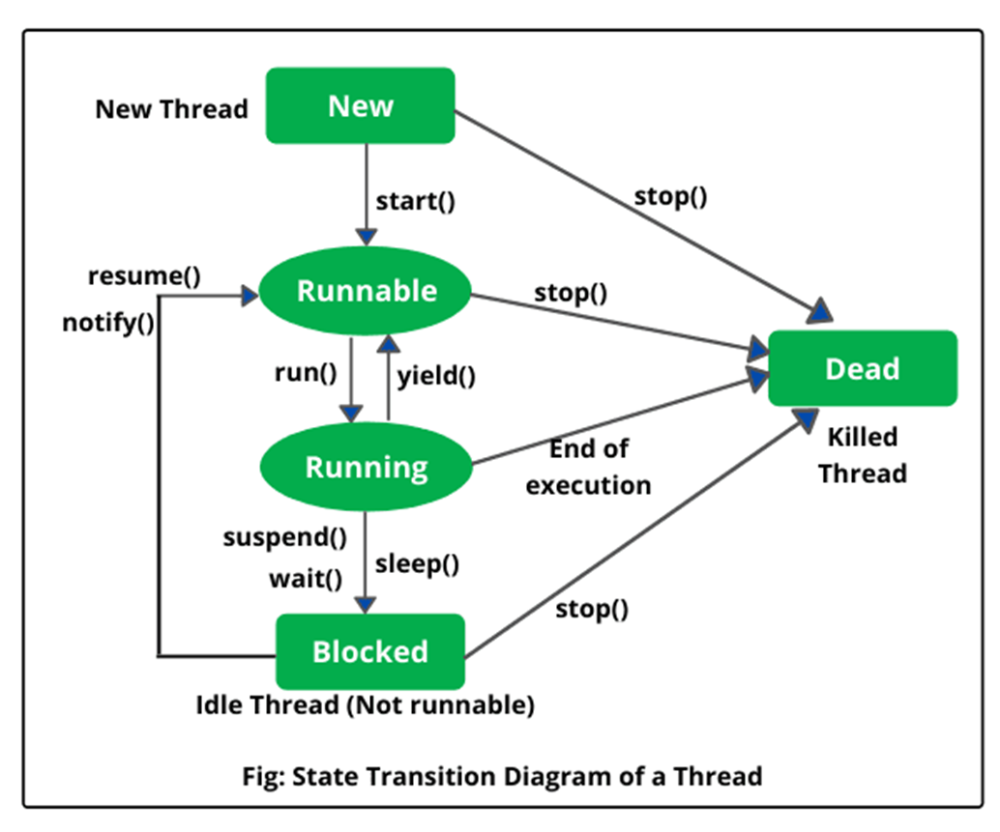

### Multiple Main Threads
* Refer in package jvm.mainthread
* Each main class is a main thread.
* In a JVM we can have multiple main threads.

### Thread Creation
* Refer in package thread.creation
* Ways to create thread in Java
1. Implement Runnable Interface
2. Extends Thread class

### Thread Lifecycle

